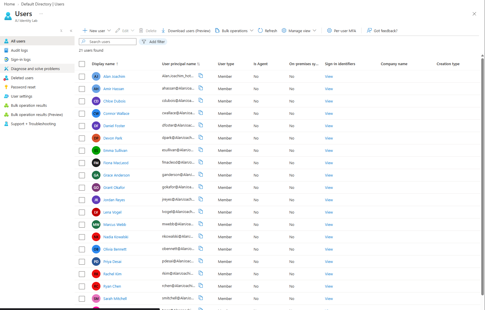

# entra-id-access-control-lab

## Overview
A hands-on Microsoft Entra ID (Azure AD) lab simulating a mid-size organization's
identity and access management setup. Built to mirror real IAM job requirements
seen in current Halifax/remote-Canada postings: user lifecycle management,
group-based access control, and least-privilege principles applied at the
resource level.

**Tenant:** AJ Identity Lab (Microsoft Entra ID Free tier)

## What I Built
- 21 user accounts across 6 departments (IT, Finance, HR, Sales, Security, Executive),
  bulk-provisioned via CSV import rather than manual entry
- 6 Microsoft Entra security groups, one per department, with correctly scoped membership
- 5 Azure resource groups (IT-Resources, Finance-Resources, HR-Resources,
  Security-Resources, Executive-Resources), each with a group-based Reader
  role assignment scoped to that department's group
- Sales-Team intentionally left with no role assignment, a deliberate
  least-privilege control case: not every department needs elevated or even
  read access to infrastructure

## Architecture & Design Decisions
Access is assigned to **groups, not individual users**. Adding or removing
someone from a department means adding or removing them from one group,
the RBAC assignment itself never needs to change. This is the standard
enterprise pattern and scales the way individual-user role assignment doesn't.

Role assignments are scoped at the **resource group level**, not the
subscription level, so each department's access boundary is explicit and
auditable rather than broad by default.

## Challenges & Troubleshooting
**Directory roles vs. Azure RBAC:** Initially attempted to assign the
Helpdesk Administrator directory role to the IT-Team group. Microsoft Entra
directory roles only support group-based assignment with Entra ID Governance
or PIM for Groups enabled, both Premium features unavailable on the Free
tier. Pivoted to Azure RBAC (Reader role, scoped to a dedicated resource
group) instead, which supports group assignment natively and is
representative of how most day-to-day resource access is actually managed
in enterprise Azure environments.

**Bulk user provisioning:** Used a PowerShell script to generate a
correctly formatted CSV for Entra ID's bulk-create feature rather than
manually creating 20+ accounts through the portal UI. Along the way, hit
and resolved a OneDrive-redirected Desktop path issue when exporting the
file, a reminder that real environments rarely match documentation
defaults exactly.

## Screenshots
## Screenshots

*21 users provisioned across 6 departments via bulk CSV import*

*IT department security group membership*

*Finance department security group membership*

*All 6 department security groups*

*Reader role assigned to IT-Team group at the resource group scope*

*Reader role assigned to Finance-Team group at the resource group scope*

*All 5 department-scoped resource groups*

## Skills Demonstrated
- Microsoft Entra ID user and group administration
- Azure RBAC role assignment and scoping
- Group-based least-privilege access control design
- PowerShell scripting for bulk identity provisioning
- Troubleshooting real environment/licensing constraints
